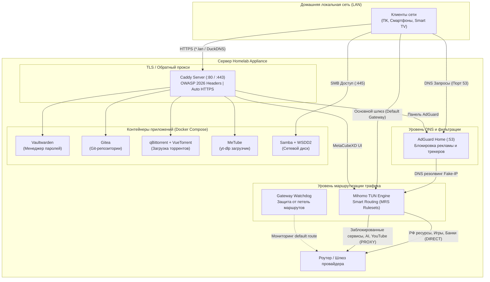

# 🏠 Homelab Appliance & Transparent Gateway (Kaxa Enterprise Edition 2026)

[](https://kernel.org)
[](https://www.docker.com/)
[](https://adguard.com/adguard-home.html)
[](https://github.com/MetaCubeX/mihomo)
[](https://caddyserver.com/)
[](https://gitlab.com/cryptsetup/cryptsetup)
[](LICENSE)

> **Автоматизированный комплекс прозрачного сетевого шлюза, шифрованного хранилища и селф-хостинг сервисов нового поколения для серверов, мини-ПК и домашних лабораторий на Linux.**

---

## ⚡ Мгновенный запуск (Quick Start)

Скрипт полностью автономен, автоматически определяет среду выполнения, синхронизирует время, разворачивает стек Docker CE и оптимизирует память.

### 🚀 Быстрый запуск в одну строку (One-Liner)

#### Вариант через `curl` (Рекомендуется):
```bash
curl -fsSL https://raw.githubusercontent.com/unknownpeace/arch-homelab-gateway/refs/heads/main/install.sh | sudo bash
```

#### Вариант через `wget`:
```bash
wget -qO- https://raw.githubusercontent.com/unknownpeace/arch-homelab-gateway/refs/heads/main/install.sh | sudo bash
```

> 💡 **Интерактивность в пайпе:** Скрипт автоматически связывает стандартный ввод с активным терминалом (`/dev/tty`), поэтому интерактивные диалоги работают корректно даже при вызове через конвейер (`| sudo bash`).

---

### 🛡️ Безопасный запуск (Zero-Trust / Ревизия перед запуском)

Если корпоративные политики безопасности или личные правила требуют предварительного аудита кода перед выполнением с правами суперпользователя:

```bash
# 1. Скачайте скрипт без немедленного выполнения
curl -fsSLO https://raw.githubusercontent.com/unknownpeace/arch-homelab-gateway/refs/heads/main/install.sh

# 2. Проверьте содержимое и контрольные суммы
less install.sh
sha256sum install.sh

# 3. Сделайте файл исполняемым
chmod +x install.sh

# 4. Запустите установку с повышенными привилегиями
sudo ./install.sh
```

---

### ⚙️ Передача флагов и параметров в One-Liner

Скрипт поддерживает предварительную инициализацию через переменные окружения, что позволяет автоматизировать установку в CI/CD или скриптах автоматизации:

```bash
# Передача переменных окружения через Process Substitution
sudo SAVED_ADMIN_USER="sysadmin"      SAVED_STORAGE_MODE="1"      SAVED_SUB_URL="https://example.com/clash-sub"      bash <(curl -fsSL https://raw.githubusercontent.com/unknownpeace/arch-homelab-gateway/refs/heads/main/install.sh)
```

---

## 📋 Системные требования (Prerequisites)

### Поддерживаемые операционные системы (Архитектура 2026):
* **Debian**: 13 (Trixie) — *Рекомендуется*; Debian 12 (Bookworm) — *Режим совместимости*.
* **Ubuntu**: 26.04 LTS (Resolute Raccoon) — *Рекомендуется*; Ubuntu 24.04 LTS (Noble Numbat) — *Поддерживается*.
* **Arch Linux / Manjaro / EndeavourOS**: Актуальный rolling-release.

### Базовые утилиты:
Для запуска однострочника требуются только `curl` (или `wget`), `bash` версии 4.4+ и права `sudo`. Все остальные зависимости (Docker CE, Btrfs, cryptsetup, python3, zram) скрипт установит автоматически.

#### Команда быстрой подготовки чистой системы:
* **Debian / Ubuntu**:
  ```bash
  sudo apt-get update && sudo apt-get install -y curl ca-certificates bash sudo
  ```
* **RHEL / Fedora / AlmaLinux / Rocky Linux**:
  ```bash
  sudo dnf install -y curl ca-certificates bash sudo
  ```
* **Arch Linux**:
  ```bash
  sudo pacman -Sy --noconfirm curl ca-certificates bash sudo
  ```

---

## 🔍 Что происходит под капотом (How It Works & Security)

Скрипт спроектирован по стандарту `set -euo pipefail` с перехватом сигналов `ERR`, `INT`, `TERM` и защитой от утечек терминала. Все этапы строго изолированы и выполняются прозрачно:

1. **Синхронизация системного времени:**
   * Считывание актуального времени из заголовков доверенных HTTP-серверов (`connectivitycheck.gstatic.com`, `deb.debian.org`).
   * Активация `systemd-timesyncd` и `timedatectl` для исключения рассинхронизации TLS-хэндшейков.
2. **Установка официального стека Docker CE:**
   * Удаление устаревших пакетов дистрибутива (`docker.io`, `podman-docker`).
   * Добавление официального репозитория Docker с GPG-ключами и динамическим выбором совместимого codename.
   * Конфигурация отказоустойчивых зеркал Docker Hub 2026 года (`timeweb.cloud`, `cloud.ru`, `huecker.io`) с исключением устаревшего `gcr.io`.
   * Автоматическое согласование версии Docker API (не ниже 1.45 для Docker 28+/29+) и установка системного CLI-плагина `dc` (`/usr/local/bin/dc`).
3. **Защита накопителей и оптимизация ресурсов:**
   * Ограничение журнала `systemd-journald` до 100 МБ для продления ресурса флеш-памяти (SSD/eMMC).
   * Выделение zRAM-диска с алгоритмом сжатия `zstd` (приоритет swap 100) на системах с RAM ≤ 4 ГБ.
   * Автоматическое создание аварийного `swapfile` (1.5 ГБ) с поддержкой Btrfs No-COW для защиты от OOM Killer.
   * Включение флага No-COW (`chattr +C`) для баз данных SQLite (Gitea, Vaultwarden, AdGuard) и торрент-загрузок.
4. **Безопасность дискового хранилища:**
   * **Система Safety Guard:** функция `assert_safe_device` намертво блокирует случайное форматирование системного диска (`/`) и разделов `/boot`, `/efi`, `/usr`, `/var`, `/home`.
   * Поддержка шифрования **LUKS2** с алгоритмом формирования ключа **Argon2id** (`cryptsetup luksFormat --type luks2 --pbkdf argon2id`).
   * Генерация криптографического ключ-файла в `/etc/cryptsetup-keys.d/` (права `0400`) с безопасной интеграцией в `/etc/crypttab` и `/etc/fstab`.
   * Создание аварийного скрипта ручного открытия `/usr/local/bin/homelab-unlock`.
5. **Сетевой шлюз и защита от петель маршрутизации:**
   * Освобождение порта 53: перевод `systemd-resolved` в режим `DNSStubListener=no` и блокировка перезаписи через NetworkManager.
   * Включение алгоритма управления перегрузкой **TCP BBR** и IP-форвардинга (`net.ipv4.ip_forward = 1`).
   * Настройка `rp_filter = 2` (loose mode) для асимметричной маршрутизации через TUN-интерфейс Mihomo.
   * Установка службы и таймера `network-gateway-watchdog.timer`: каждые 60 секунд проверяет и восстанавливает маршрут по умолчанию через физический роутер, предотвращая сетевые петли.
   * Блокировка прямого доступа к незащищенному порту 8083 AdGuard Home из внешней LAN (доступ открыт строго через Caddy HTTPS).
6. **Криптография и менеджмент секретов:**
   * Хэширование паролей AdGuard Home по стандарту **Bcrypt** (`$2b$` с солью cost 10) без утечки в список процессов `ps aux`.
   * Хэширование мастер-токена Vaultwarden по стандарту **Argon2id**.
   * Хэширование веб-пароля qBittorrent по алгоритму **PBKDF2-HMAC-SHA512** (100 000 итераций).
7. **Автоматическое резервное копирование:**
   * Таймер `vaultwarden-backup.timer`: ежедневный горячий бэкап SQLite базы (`.backup`) в 03:00 с ротацией архивов 14 дней.
   * Таймер `gitea-backup.timer`: ежедневный нативный дамп репозиториев Gitea в 03:30 с ротацией 14 дней.
8. **Безопасность веб-доступа (Caddy 2):**
   * Автоматический HTTPS для локальных доменов `*.lan` (с экспортом корневого сертификата CA в сетевую папку) либо публичный Wildcard SSL от Let's Encrypt через DuckDNS DNS-01 API.
   * Современные заголовки безопасности (OWASP 2026): HSTS (31536000), `X-Content-Type-Options: nosniff`, `X-Frame-Options: SAMEORIGIN`, `X-XSS-Protection: 0`, `Permissions-Policy`.
   * Предварительное создание учетной записи администратора в Gitea и AdGuard Home.

---

## 🎛️ Режимы развертывания и параметры (CLI Reference)

При запуске скрипт предлагает интерактивное меню из 3 режимов:

| Режим | Название | Назначение |
| :--- | :--- | :--- |
| **`1`** | **Экспресс-установка** *(Default)* | «Всё включено»: все сервисы активны, автоматическая маршрутизация, внутренние домены `*.lan`, хранилище на системном диске. |
| **`2`** | **Расширенная настройка** | Полный контроль: выбор дисков (системный, внешний, форматирование Btrfs, LUKS2 шифрование), включение отдельных компонентов, выбор DuckDNS SSL. |
| **`3`** | **Сброс стека (Reset)** | Полная остановка контейнеров, очистка конфигураций, бэкап имеющихся сертификатов, удаление юнитов systemd и возврат к исходному состоянию. |

### Таблица поддерживаемых компонентов стека:

| Компонент | Роль | Порты / Протоколы | Домен по умолчанию |
| :--- | :--- | :--- | :--- |
| **AdGuard Home** | DNS-фильтрация рекламы, DoH/DoT апстримы | `53/udp`, `53/tcp`, `8083/tcp` (внутр.) | `https://adguard.lan` |
| **Mihomo TUN** | Прозрачный умный роутинг (MetaCubeX, MRS) | `7890` (Mixed), `9090` (API), TUN | `https://proxy.lan` |
| **Caddy 2** | Reverse Proxy, SSL-терминация, компрессия | `80/tcp`, `443/tcp` | Фронтенд для всех `*.lan` |
| **Vaultwarden** | Менеджер паролей (Bitwarden API, Argon2id) | `80/tcp` (внутр.) | `https://vault.lan` |
| **Gitea** | Автономный Git-сервер и трекер задач | `3000/tcp` (внутр.), `2222/tcp` (SSH) | `https://git.lan` |
| **Samba + WSDD2** | Сетевое хранилище NAS с автообнаружением | `139/tcp`, `445/tcp`, `3702/udp` | `\\<IP_СЕРВЕРА>\storage` |
| **qBittorrent** | Торрент-клиент с WebUI VueTorrent | `8080/tcp` (внутр.), `6881/tcp+udp` | `https://torrent.lan` |
| **MeTube** | Загрузчик видео/аудио на базе `yt-dlp` | `8081/tcp` (внутр.) | `https://metube.lan` |
| **Watchtower** | Автообновление Docker-контейнеров (API 1.45+) | Внутренний сокет | Фоновый процесс |

---

## 🔧 Конфигурация (.env)

Все параметры сохраняются в защищенном конфигурационном файле `/opt/homelab/.env` с правами `0600 (root:root)`. При повторном запуске скрипта значения подтягиваются автоматически.

### Основные переменные конфигурации:

| Переменная | Тип | Значение по умолчанию | Описание |
| :--- | :--- | :--- | :--- |
| `SAVED_PHYS_IFACE` | `string` | *(Auto-detected)* | Физический сетевой интерфейс локальной сети (например, `eth0`, `enp3s0`). |
| `SAVED_LOCAL_IP` | `string` | *(Auto-detected)* | Статический IP-адрес сервера в локальной сети. |
| `SAVED_ROUTER_GATEWAY`| `string` | *(Auto-detected)* | IP-адрес домашнего маршрутизатора (шлюза). |
| `SAVED_LAN_SUBNET` | `string` | *(Auto-detected)* | Подсеть домашней сети в нотации CIDR (например, `192.168.1.0/24`). |
| `SAVED_STORAGE_MODE` | `integer`| `1` | Режим хранилища: `1` (Системный диск), `2` (Раздел), `3` (Btrfs wipe), `4` (LUKS2), `5` (LUKS2 wipe). |
| `SAVED_SAVE_DIR` | `string` | `/home/<user>/save` | Абсолютный путь к каталогу для хранения пользовательских данных и медиа. |
| `SAVED_ENABLE_GATEWAY`| `string` | `Y` | Активация связки AdGuard Home + Mihomo TUN (`Y` / `n`). |
| `SAVED_ENABLE_VAULT` | `string` | `Y` | Развертывание менеджера паролей Vaultwarden (`Y` / `n`). |
| `SAVED_ENABLE_GITEA` | `string` | `Y` | Развертывание Git-сервера Gitea (`Y` / `n`). |
| `SAVED_ENABLE_SAMBA` | `string` | `Y` | Активация файлового хранилища Samba с WSDD2 (`Y` / `n`). |
| `SAVED_ENABLE_QBIT` | `string` | `Y` | Развертывание qBittorrent + VueTorrent (`Y` / `n`). |
| `SAVED_ENABLE_METUBE` | `string` | `Y` | Развертывание загрузчика MeTube (`Y` / `n`). |
| `SAVED_SSL_MODE` | `integer`| `1` | Режим сертификатов: `1` (Локальный Caddy CA), `2` (DuckDNS Wildcard Let's Encrypt). |
| `SAVED_DUCKDNS_NAME` | `string` | `""` | Имя поддомена DuckDNS (при `SAVED_SSL_MODE=2`). |
| `SAVED_DUCKDNS_TOKEN`| `string` | `""` | Секретный токен API DuckDNS. |
| `SAVED_SUB_URL` | `string` | `none` | Ссылка на подписку Clash/Mihomo (при `none` включается режим `DIRECT`). |
| `SAVED_ADMIN_USER` | `string` | `$TARGET_USER` | Имя администратора для веб-интерфейсов и Samba. |
| `SAVED_MASTER_PASS` | `string` | *(Auto-generated)* | Единый защищенный мастер-пароль ко всем службам. |

---

## 🗺️ Диаграмма сетевой архитектуры (Mermaid)



---

## 🌐 Настройка роутера (1 действие для всей сети)

Чтобы все устройства в домашней сети автоматически получили фильтрацию рекламы, ускорение и доступ к локальным сервисам без настройки каждого отдельного смартфона:

1. Откройте панель управления домашним роутером (обычно `192.168.1.1` или `192.168.0.1`).
2. Перейдите в раздел **DHCP-сервер** (Настройки локальной сети / LAN).
3. Измените параметры, раздаваемые клиентам:
   * **Основной DNS-сервер:** укажите `IP-адрес вашего Homelab-сервера`.
   * **Основной шлюз (Default Gateway):** укажите `IP-адрес вашего Homelab-сервера`.
4. Переподключите Wi-Fi на устройствах.

---

## 🛠️ Устранение неполадок (Troubleshooting)

### 1. Ошибка: «Port 53 is already in use» (`systemd-resolved` блокирует AdGuard Home)
* **Симптом:** Контейнер `adguardhome` не может запуститься или падает с ошибкой биндинга порта 53.
* **Причина:** Встроенный DNS-заглушка `systemd-resolved` перехватывает адрес `127.0.0.53:53`.
* **Решение:** Скрипт решает это автоматически, но вручную можно применить:
  ```bash
  sudo mkdir -p /etc/systemd/resolved.conf.d/
  echo -e "[Resolve]
DNSStubListener=no
DNS=77.88.8.8 1.1.1.1" | sudo tee /etc/systemd/resolved.conf.d/disable-stub.conf
  sudo systemctl restart systemd-resolved
  ```

### 2. Браузер сообщает о недоверенном SSL-сертификате (`*.lan`)
* **Симптом:** При переходе на `https://vault.lan` или `https://adguard.lan` отображается предупреждение о самоподписанном сертификате (`NET::ERR_CERT_AUTHORITY_INVALID`).
* **Причина:** В режиме `SSL_MODE=1` Caddy выпускает сертификаты через собственный внутренний корневой удостоверяющий центр (Root CA).
* **Решение:** Импортируйте корневой сертификат в доверенные центры вашей ОС/браузера:
  * Сертификат находится на сервере: `<SAVE_DIR>/certificates/caddy-root.crt`
  * Доступен по сети через Samba: `\<IP_СЕРВЕРА>\storage\certificates\caddy-root.crt`
  * В Windows: дважды кликните по файлу -> *Установить сертификат* -> *Локальный компьютер* -> *Поместить в «Доверенные корневые центры сертификации»*.

### 3. Ошибка разблокировки зашифрованного диска LUKS2 при старте
* **Симптом:** Служба `homelab.service` не запускается после перезагрузки с ошибкой `RequiresMountsFor`.
* **Причина:** Ключ авторазблокировки не был считан или диск был переподключен в другой порт.
* **Решение:** Запустите ручную разблокировку встроенной утилитой:
  ```bash
  sudo homelab-unlock
  ```
  Утилита запросит пароль шифрования, смонтирует Btrfs-том с опциями сжатия `zstd` и автоматически поднимет стек контейнеров Docker.

---

## 💻 Полезные команды управления

```bash
# Просмотр статуса всех сервисов стека
dc ps

# Просмотр журналов конкретного сервиса в реальном времени
dc logs -f adguard
dc logs -f mihomo
dc logs -f caddy

# Перезапуск всего комплекса
sudo systemctl restart homelab.service

# Просмотр сформированного отчета самодиагностики
cat /opt/homelab/diagnostic_report.log
```

---

## 📄 Лицензия (License)

Проект распространяется под открытой лицензией [MIT License](LICENSE). Вы можете свободно использовать, модифицировать и распространять данный комплекс в личных и коммерческих целях.